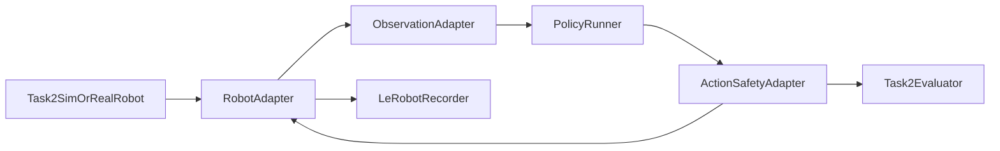

# Plan

## 1. Selection: Task 2 Thermal Pad Placement in Isaac Sim

**Decision:** Start with Task 2 in Isaac Sim. It has the shortest path to a
repeatable train–evaluate loop: a LeRobot v3 recorder, shared action/state and
camera contract, reset/randomization, dataset validation, labels, and a local
IoU evaluator already exist.

| Criterion | Task 1 MuJoCo | Task 1 Isaac | Task 2 Isaac |
| --- | --- | --- | --- |
| Expected off-the-shelf model performance | Medium | Bad | Medium |
| Data-collection utilities | Medium | Medium | Good |
| Evaluation utilities | Medium | Bad | Good |
| Other utilities | Good | Medium | Good |
| Development easiness | Good | Bad | Medium |

Selection rationale, trade-offs, and rating definitions

“Off-the-shelf” means a pretrained policy after an embodiment/action adapter,
before task-specific fine-tuning. No evidence shows GR00T, Pi0.5, ACT, or
Diffusion Policy succeeding zero-shot at either deformable task.

- **Task 2 is Good for data and evaluation** because it records applied actions,
  37-dimensional state, four RGB streams, reset metadata, deformable labels,
  and evaluates placement IoU locally.
- **Task 1 MuJoCo remains Good for development ease:** a portable, single
  process world with verified teleoperation, but it lacks a LeRobot recorder
  and its vendored scoring client is marked paused.
- **Task 1 Isaac is not a baseline candidate:** the coupled cable and robot
  worlds do not yet have a verified full teleoperated task.

The decision deliberately drops valid Task 1 MuJoCo advantages:

- direct cable-routing, tension-management, bimanual regrasping, and plugging
  alignment;
- a simpler, more portable single-process runtime;
- lower physics-debugging ambiguity; and
- more verified teleoperation modes (keyboard, gamepad, VR, GELLO, ROS 2).

These are accepted trade-offs because the pre-existing Task 2 learning loop is
the higher priority. Task 2 still needs Isaac Sim 5.1, NVIDIA GPU, Docker,
ROS 2, and PhysX GPU deformables. Its score is pick success × orientation
success × placement IoU; wrong orientation scores zero.

#### Reassessing the recorder and evaluator advantage

**Task 1 MuJoCo LeRobot recorder — feasible, substantial effort.** Reuse the
Task 2 recorder's LeRobot v3 dataset creation, feature metadata, frame-writing,
video encoding, validation, and `finalize()` lifecycle. Replace its ROS-topic
subscriptions with direct reads from the single `TeleopSession`:

- `MjData` already exposes robot joint/base state, TCP poses, contact forces,
  cable-segment body poses, and simulation time;
- the session already owns the applied control path and the shared control loop,
  so it can record action/state at a deterministic simulation rate; and
- the existing offscreen `mnet_overhead` renderer provides a first RGB camera.
  Add wrist/head cameras only after a one-camera recorder is validated.

The non-trivial work is defining action semantics that transfer to hardware,
adding a recording ROS contract/bridge, deterministic reset/episode controls,
four synchronized camera publishers, Docker/launcher support, and dataset
tests. A production-quality equivalent is approximately 3–4 engineer-weeks;
it is not a copy-paste of the ROS-based Task 2 recorder. Start with GELLO or
explicit joint-target logging because the default MuJoCo IK path applies
velocity actions, unlike Task 2's recorded absolute joint targets.

**Task 2 evaluator — limited early-training signal.** The shipped evaluator
snapshots semantic/bounding-box data and computes orientation-gated final
placement IoU. It can be called during a rollout, so it is useful for checking
camera labels, pickup/transport milestones, and whether the policy reaches the
target. But it is sparse: until the pad appears near the target with the right
orientation, the score is normally zero. It is a terminal benchmark metric,
not a sufficient dense reward or diagnosis tool for early policy learning.

**Task 1 internal evaluator — feasible, substantial effort.** MuJoCo makes this
easier than a vision-only evaluator because fixture transforms, cable segment
poses/velocities, contacts, gripper grasp state, and the randomized Tier-2
routing configuration are directly available. An internal-only evaluator can
report:

1. each route waypoint/fixture reached in the required order;
2. cable occupancy and side/through-clip correctness at each fixture;
3. prefix completion (the number of correctly routed sequential fixtures);
4. grasp/regrasp count, cable tension/length proxy, contact-force violations,
   and cable stability; and
5. final connection/adapter proximity.

This evaluator is appropriate for development dashboards, curriculum stages,
and simulator-only RL rewards. A Tier-2 prototype, routing tests, and
human/official-score validation are approximately 2–3 engineer-weeks. It must
not be treated as the official score or as a real-robot policy input; the
official server logic and Y-checkpoints are not available locally.

**Decision impact:** these additions would substantially reduce Task 1's
current data/evaluation disadvantage, but do not eliminate it—the Task 2
versions already exist and have been validated. Therefore the target remains
Task 2 for the fastest first learned-policy result. Revisit Task 1 after the
Task 2 baseline only if cable routing becomes the primary product objective or
the team explicitly accepts roughly 5–7 engineer-weeks of recorder/evaluator
implementation and validation as the next work package.

## 2. First end-to-end baseline

**Goal:** one policy process runs unchanged against Task 2 simulation and the
real robot. Only a robot adapter changes. The first baseline must load a
checkpoint, consume synchronized observations, produce safe action chunks,
reset cleanly between episodes, and write evaluation rollouts.

### Reuse these open-source components

| Project | Reuse | Do not adopt |
| --- | --- | --- |
| [LeRobot](https://huggingface.co/docs/lerobot/index) | LeRobot v3 dataset, `lerobot-train`, checkpoint/config format, preprocessing, policy interface, rollout conventions | Its robot-specific drivers; the FR3 Duo and Task 2 ROS adapter are custom |
| [LeHome Challenge](https://github.com/lehome-official/lehome-challenge) | LeRobot policy configuration, generic policy loader/evaluator pattern, and custom-policy fallback | Its Isaac Lab environment and garment-specific task code |
| Existing Task 2 stack | recorder, `config/topics.yaml`, camera publishers, bridge, reset/randomization, dataset validation, local evaluator | None; treat its current ROS contract as the simulation implementation of the robot adapter |

**Initial policy:** train an ACT model first, using head plus wrist RGB and
proprioception. ACT is the lowest-risk initial model for precise bimanual
imitation learning. Run Diffusion Policy as the sequence-control comparison
only after the ACT pipeline is verified. Try SmolVLA only after the data covers
reset/object variations and task-language labels. Treat GR00T as a later
experiment: it needs an FR3 Duo modality configuration and a derived LeRobot
v2 conversion, while LeRobot v3 remains the canonical dataset. None removes
the need for Task 2 demonstrations.

Baseline architecture and control flow

1. **Robot adapter:** runs as a host-network ROS 2 node and subscribes to the
   recorder's RGB, state, clock, and reset topics. The simulation adapter uses
   `topics.py` plus the tensor builders in `record_task2.py`, so inference
   feature construction exactly matches training. The real adapter has the
   same interface but maps to FR3 Duo cameras, state, and controller APIs.
2. **Observation adapter:** time-aligns frames and state at dataset FPS, applies
   the exact LeRobot feature names/shapes, and attaches the fixed task text.
   Ground-truth sidecar and evaluation-camera topics are for labels/evaluation
   only, never policy inputs, to prevent a simulation-to-real mismatch.
3. **Policy runner:** owns the LeRobot `PreTrainedPolicy` checkpoint and exposes
   `load`, `reset`, and `act`. It queues action chunks asynchronously, so camera
   preparation/inference cannot block the control loop.
4. **Action and safety adapter:** converts normalized policy actions to base
   twist, arm joint targets, gripper targets, and spine target; clamps joint
   bounds, velocity/acceleration, workspace, gripper force, and command age.
   It holds position/stops on stale input or reset. Human teleoperation and
   policy commands require explicit arbitration; never publish both directly to
   the robot controller.
5. **Evaluation runner:** creates a fresh randomized episode, calls
   `PolicyRunner.reset`, launches a bounded rollout, stores video/actions, and
   invokes the existing local IoU evaluator.

The policy command is 20-dimensional, but the current ROS control interface
only accepts arm/gripper targets directly. The baseline must therefore add
`policy_command` → controller adapters for all action groups:

- arm and gripper adapters publish the existing `/isaac/*_joint_commands`;
- a base adapter maps policy twist to the currently discrete `/pedal/state`
  command until the bridge exposes a continuous base-twist topic; and
- a spine adapter requires a small bridge extension because the spine is
  recordable today but not controllable through ROS.

Run policy evaluation with recording enabled and conflicting browser,
republisher, and keyboard-arm publishers disabled. The policy command and
adapters stay separate from teleoperation topics so manual takeover remains
available and the same policy contract can serve simulation and hardware.

Implementation milestones and acceptance criteria

1. Add a dedicated policy package with adapter, runner, safety/arbitration, and
   evaluation-launch interfaces; reuse `topics.py` and recorder feature
   builders rather than duplicating tensor schemas.
2. Add the missing base and spine policy-command adapters, then read the
   existing Task 2 observation streams and publish a fixed safe pose through
   every action group; verify watchdog, reset, and manual takeover.
3. Run a frozen LeRobot checkpoint and record an evaluation rollout, even if it
   has no task success.
4. Train and evaluate ACT on one valid Task 2 dataset version. Report rollout
   success, IoU, safety stops, and inference latency against a teleoperation
   reference.
5. Implement the real adapter only after the simulator baseline passes the same
   contract tests and safety checks.

## 3. Policy improvement

Collect successful and near-miss teleoperation episodes through the existing
recorder, keep them in LeRobot v3, and train/evaluate on fixed scenario splits.
Use simulator randomization for visual, initial-pose, material, and board
variation; reserve the local evaluator for a held-out test set.

Data and RL follow-up

- Record expert, recovery, and failure episodes with episode-level outcome and
  phase labels, plus a stable natural-language task string. Keep
  action/state/camera features identical between sim and real data; add real
  datasets as additional LeRobot dataset roots.
- Keep LeRobot v3 as the source-of-truth corpus. Create a separate v2 export
  and FR3 Duo modality configuration only for GR00T; never downgrade the
  primary dataset to support one model.
- Start with behavior cloning; prioritize targeted recollection for failed
  phases such as peel, transport, alignment, and release.
- Use DAgger-style human corrections once policy rollouts reach the task
  workspace. Do not use evaluator ground truth as a policy input.
- For RL, keep the learned visual policy as initialization and train a
  simulator-only residual/action refinement with dense rewards from object
  state, pad deformation, contact/force limits, and final IoU. Domain-randomize
  before transfer and validate only with observations available on the real
  robot.

